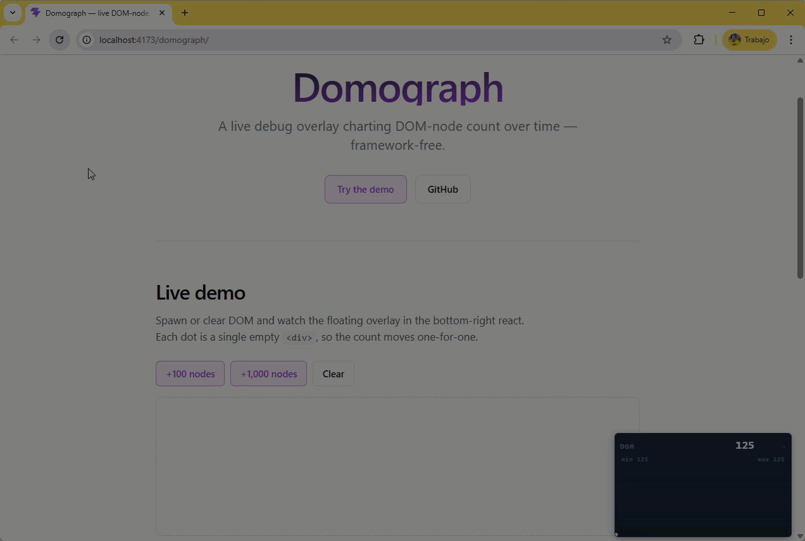

# domograph

A live debug overlay that charts DOM node count over time. Useful for spotting
leaks and runaway component trees while developing single-page apps.

Framework-free core, with first-class Vue 3 bindings.

<p align="center">
  
</p>

## Packages

| Package                          | Description                                 |
| -------------------------------- | ------------------------------------------- |
| [`domograph`](packages/core)     | Framework-free overlay. Drop into any page. |
| [`@domograph/vue`](packages/vue) | Vue 3 plugin + `useDomograph()` composable. |

## Quick start

### Vanilla

```bash
bun add domograph
```

```ts
import { createDomograph } from "domograph";

const monitor = createDomograph({ position: "bottom-right" });
monitor.show(); // mounts to document.body and starts sampling
```

### Vue 3

```bash
bun add @domograph/vue
```

```ts
import { createApp } from "vue";
import App from "./App.vue";
import DomographPlugin from "@domograph/vue";

createApp(App)
  .use(DomographPlugin) // auto-mounts when import.meta.env.DEV is true
  .mount("#app");
```

See each package's README for the full options reference.

## Repository layout

```
apps/
  website/        Demo + docs site
packages/
  core/           domograph
  vue/            @domograph/vue
```

This is a [Vite+](https://voidzero.dev/vite-plus) monorepo managed with Bun.
See [AGENTS.md](AGENTS.md) for the toolchain details.

## Development

Install dependencies:

```bash
vp install
```

Run the demo site:

```bash
vp run dev
```

Run tests across all packages:

```bash
vp run -r test
```

Build all packages:

```bash
vp run -r build
```

Format, lint, and type-check everything:

```bash
vp check
```

The `ready` script runs the full pre-commit gauntlet (`check`, `test`, `build`):

```bash
vp run ready
```

## License

MIT &copy; [David Vallejo](https://github.com/thyngster)
